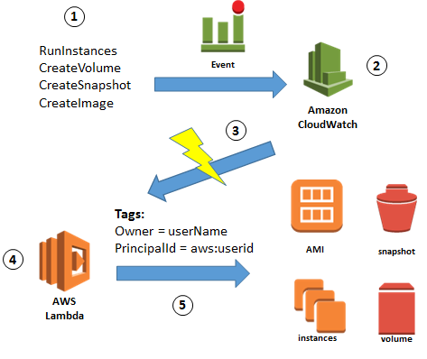

# aws-auto-tagging
The aws-auto-tagging tool is made to automatically apply the tags to newly created resources such EC2, EKS, RDS, VPC, ElastiCache, DMS, S3, DynamoDB, Lambda, EFS, EBS, ELB, OpenSearch, SNS, SQS, KMS.  At this time, the MAP Program customers of AWS are the main focus.

The tool consists of an AWS Lambda function, an Amazon EventBridge Events rule

## Prepare
1. Download the CloudFormation template https://github.com/inarongrit/aws-auto-tagging/blob/main/aws-tagging-automation.yaml
2. AWS Account

## Deploy
1. Open the AWS Console and navigate to CloudFormation
2. Click Create Stack
3. Click "Upload a template file" and select the CloudFormation template that you've downloaded
4. Enter a name in "Stack name"
5. Parameter settings
    
    A. **AutomationTags** : Enter the Tag that is automatically marked for each resource in the form of json, such as: {"tag1": "test1","tag2": "test2"} 
       
       Note : Check tagging name and value from your MAP Agreement
    
    B. **EventBridgeRuleName**: Enter the name of the EventBridge Rule, default: aws-tagging-automation-rules
    
    C. **IAMAutoTaggingPolicyName**: Enter the name of the created IAM custom managed policy, default: aws-tagging-automation-policy
    
    D. **IAMAutoTaggingRoleName**: Enter the role name created for Lambda, default: aws-tagging-automation-role
    
    E. **LambdaAutoTaggingFunctionName**: Enter the name of the lambda function, default: aws-tagging-automation-function

6. Click Next, check "I acknowledge that AWS CloudFormation might create IAM resources.", click "Create stack"
7. Stackset takes 3-5 minutes to complete

## Modify tag
You're still able to modify the tag after provision the templete
1. Go to the Lambda control interface, select the Lambda function, default: aws-tagging-automation-function
2. Go to the Configuration Tab, select Environment variables, click Edit to modify the value of the tags tag
3. Modify the value (json format), and click Save. Then when the resource is created later, it will be marked with a new tag
